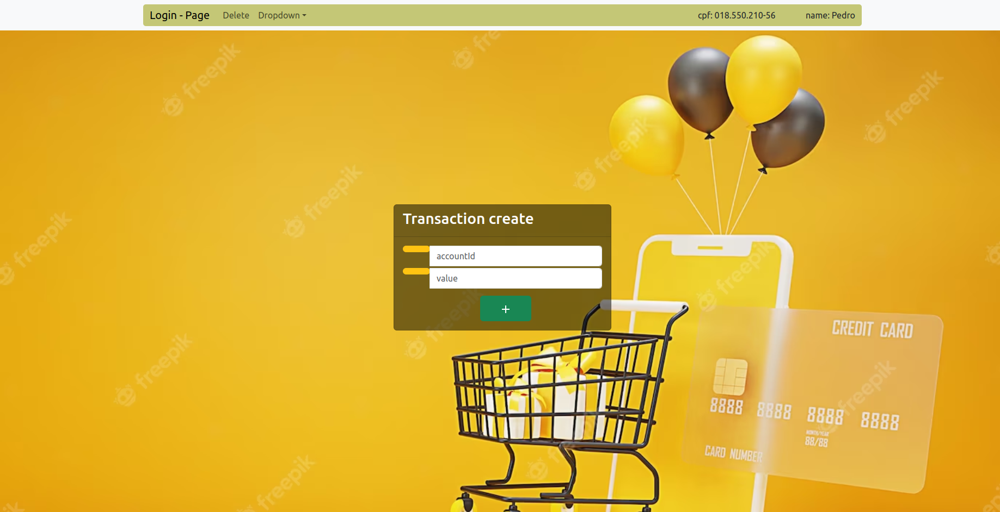
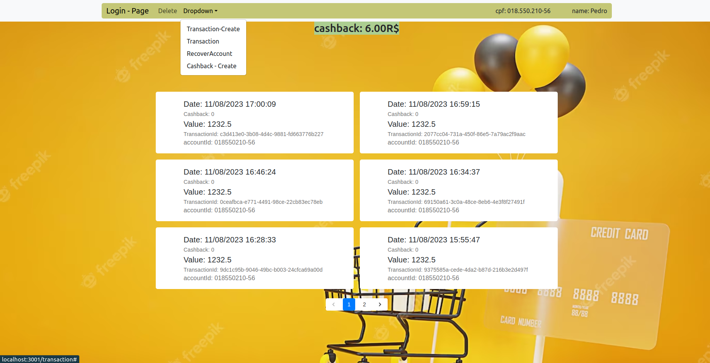
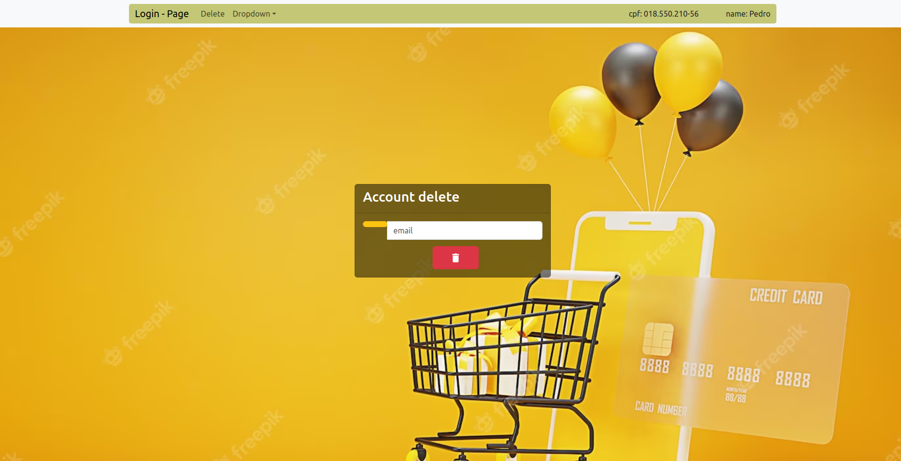

# conta-caixa
Projeto fullStack que faz transações de pagamentos e seus cashbacks.
- `API se baseia na transação de pagamento , cria usuario, adiciona cashback, extrato das transações.`
- `Testes no back-end usando jest, no front-end vitest com jest`

# 🛠️ Abrir e rodar o projeto
`git@github.com:reinaldoper/conta-caixa.git`
## Aplicação feita usando docker:
- Dentro da pasta back-end criar uma imagem:
`docker build -t <nome-sua-escolha> .`
- Na raiz do projeto:
`docker-compose up -d`
## Detalhes:
- Aplicação deverá rodar na porta: 3001.
## Rotas:

  
<strong>Rotas de Usuários</strong>

### - Endpoint para cadastrar User(POST):
  
- O endpoint deve ser acessível através do caminho (`/users`)
  
`{
  "cpf": "string",
  "name": "string",
  "password": "string",
  "email": "string"
}`
  
### - Endpoint de login(PATCH):
- O endpoint deve ser acessível através do caminho (`/users`)
  
`{
  "email": "string",
  "password": "string,
}`
  
### - Endpoint para listar transações(PATCH):
- O Endpoint de ser acessível através do caminho (`/users/transaction`)
  
`{
  "cpf": "string",
}`
  
### - Endpoint para deletar usuario(DELETE):
  
- O endpoint deve ser acessível através do caminho (`/users`)
  
`{
  "email": "string",
}`

### - Endpoint para buscar usuario(PATCH):
  
- O endpoint deve ser acessível através do caminho (`/users/get`)
  
`{
  "email": "string",
}`
### - Endpoint para alterar usuario(PUT):
  
- O endpoint deve ser acessível através do caminho (`/users/recover`)
  
`{
  "email": "string",
}`

  
<strong>Rotas de Transações:</strong>

### - Endpoint para cadastrar Transação(POST):
  
- O endpoint deve ser acessível através do caminho (`/transaction`)

`{
  "accountId": "string,
  "value": "number"
}`
  
### - Endpoint para criar cashback (PUT):

- O endpoint deve ser acessível através do caminho (`/transaction`)
  
`{
  "cashback": "number,
  "transactionId": "string"
}`
  
  

## Detalhes das telas:

  
<strong>Imagens das telas da aplicação:</strong>

### - Fluxo da aplicação:
  
- Tela criar usuario:

  
- Tela listar transações:

  
- Tela deletar usuario:

  
- Tela login:

  

## Tecnologias utilizadas
 

